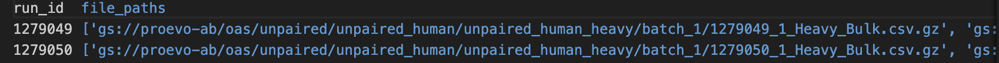
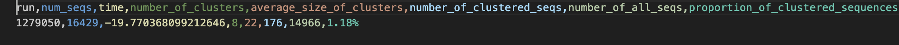

# Lineage Tree Generation

This project performs lineage tree generation for clonal families of antibody sequences, leveraging the FastBCR and ClonalTree tools. The purpose of generating lineage trees is to model that natuaral antibody affinity maturation process, which iteratively improves upon "naive" parental antibody sequences and generates antibody clones with improved affinity and specificity to an antigen or pathogen of interest. Modeling affinity maturation is a difficult task with potentially transformative impacts on AI-guided drug discovery. A model, such as an LLM, can be trained on antibody lineages to learn the associations between parental sequences and their evolved clones. This model can then be fed an initial antibody sequence or library as input and generate potential affinity-matured improved variants. Generating a large body of clonal tree data is the first step for training such a model. 

## Full Pipeline Overview

1. Batch input generation for fastBCR. The fastBCR batch input is the `human_unpaired_heavy_run_to_files.tsv` file mapping run_id to a list of file_paths.
   1. Running `python generate_gcp_input_list.py` will generate the fastBCR batch input
2. Run the GCP batch job for fastBCR
   1. `gcloud beta batch jobs submit job-fastbcr-batch-[X] --location us-central1 --config fastBCR_Docker/fastBCR_batch_config.json`
3. Batch input generation for ClonalTree. The ClonalTree input is a list of all .fasta files generated from the fastBCR pipeline.
   1. Run `./clonalTree_Docker/generate_clonalTree_batch_input.sh`.
4. Run the GCP batch job for ClonalTree
   1. `gcloud beta batch jobs submit job-clonaltree-batch-[X] --location us-central1 --config clonalTree_Docker/clonalTree_batch_config.json`


## Running Pipelines
Run the following code to run the batch jobs from scratch

### Clone Git Repo
```
git clone https://github.com/cameronhu/AntibodyLineageTree.git
cd lineage_tree
```

### FastBCR
```
python generate_gcp_input_list.py
gcloud beta batch jobs submit job-fastbcr-[X] --location us-central1 --config fastBCR_Docker/fastBCR_batch_config.json
```

### ClonalTree
```
./clonalTree_Docker/generate_clonalTree_batch_input.sh
gcloud beta batch jobs submit job-ClonalTree-[X] --location us-central1 --config clonalTree_Docker/clonalTree_batch_config.json
```

# FastBCR 

FastBCR pipeline takes in an input generated from the raw OAS directories, and outputs three different directories on GCS: runs, run_clonotypes, run_stats.

### FastBCR Input


   - `run_id` - the run_ID of all the files, in correspondence with the OAS raw data
   - `file_paths` - list of GCS file paths to raw OAS data associated with the run

### FastBCR Outputs

#### runs
- Inferred clonal families in .fasta file format. The FASTA files are organized into their run directories. These FASTA files are used as the input to ClonalTree

   - Clonotype ID followed by @ abundancy

##### run_stats
- `run_stats` contains clonal family statistics, organized by each run.

  - Contains average number of clonal families, average size of clonal families, percentage of raw sequences actually mapped to clonal families, and some timing statistics

#### run_clonotypes
- `run_clonotypes` is the mapping of the inferred clonotypes from fastBCR back to their original OAS data files.

  - `clonotype_index` is the fastBCR generated clonotype index. Clonotypes may be linked to multiple raw sequence indices from the OAS data file
  - `clonotype_count` is the number of raw OAS sequences associated with this clonotype
  - `clone_count` is the total abundancy of this clonotype
  - `clone_fre` is the frequency of this clonotype as a percentage of all sequences in the raw OAS dataframe
  - `orign_index` is the raw OAS dataframe index for the representative sequence that is used for the clonotype. Should be contained within the `index_match` list
  - `index_match` is the raw sequence indices are stored in the  column. `index_match` is an R list of all the dataframe indices that match up to this clonotype
  
# ClonalTree
Inferred lineage trees generated by the ClonalTree tool. These lineage trees are built upon the inferred clonal families generated by FastBCR, and provide distances in number of nucleotides from the inferred parental sequence.

### ClonalTree Input
- Batch input for the ClonalTree pipeline is generated from the FASTA files generated by fastBCR.

   - List of FASTA files generated by fastBCR, each representing a clonal family. 

### ClonalTree Outputs
ClonalTree outputs both standard .nk files and .nk.csv files that are more human interpretable.

##### Newick Format

   - Clonal tree in Newick format

##### Newick CSV Format

   - First column: parent clonotype_id
   - Second column: child clonotype_id
   - Third column: distance (nt) from parent to child

##### Representative Tree Graph


- Tree generation notebook within `clonalTree_Docker/tree.ipynb`

## Analysis 
- Analysis is within the `analysis/` directory. fastBCR and ClonalTree stats are organized in their own notebooks.
